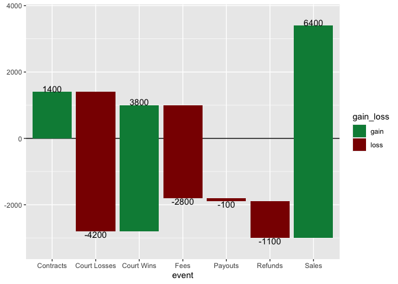
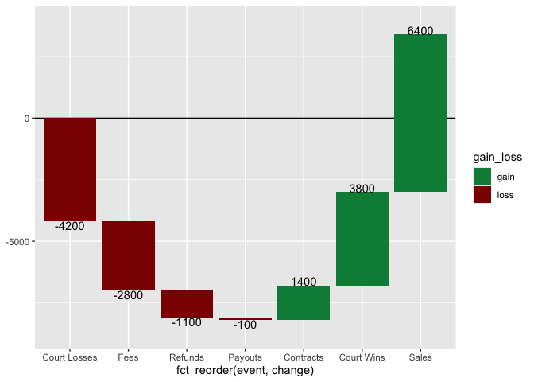
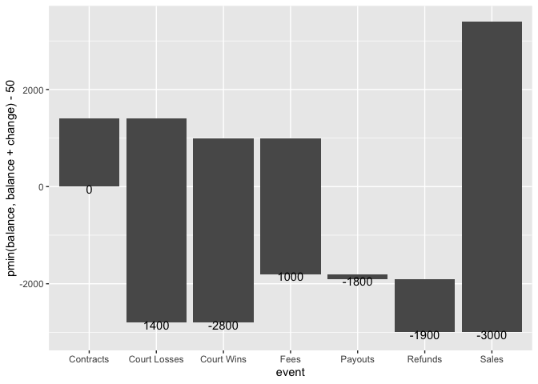

  - [*README: Below, is readme that provides steps for building a
    package. This readme acts as a checklist, and control document as
    functions used in package building are included. 🚧 ✅
    *](#readme-below-is-readme-that-provides-steps-for-building-a-package-this-readme-acts-as-a-checklist-and-control-document-as-functions-used-in-package-building-are-included---)
  - [Introducing the {ggwaterfall}
    package\!](#introducing-the-ggwaterfall-package)
      - [Example](#example)
  - [Part I. Work out functionality ✅](#part-i-work-out-functionality-)
      - [Step 0. use base ggplot2 to get job
        done](#step-0-use-base-ggplot2-to-get-job-done)
      - [Step 1. & 2. write compute functions and pass to
        ggproto](#step-1--2-write-compute-functions-and-pass-to-ggproto)
      - [Step 3. pass to geom\_ / stat\_](#step-3-pass-to-geom_--stat_)
      - [Step 4. Enjoy (test)](#step-4-enjoy-test)
  - [Part II. Packaging and documentation 🚧
    ✅](#part-ii-packaging-and-documentation--)
      - [Phase 1. Minimal working
        package](#phase-1-minimal-working-package)
          - [Created files for package archetecture with
            `devtools::create(".")`
            ✅](#created-files-for-package-archetecture-with-devtoolscreate-)
          - [Moved functions R folder? ✅](#moved-functions-r-folder-)
          - [Added roxygen skeleton? ✅](#added-roxygen-skeleton-)
          - [Managed dependencies ? ✅](#managed-dependencies--)
          - [Chosen a license? ✅](#chosen-a-license-)
          - [Run `devtools::check()` and addressed errors?
            ✅](#run-devtoolscheck-and-addressed-errors-)
          - [Build package 🚧](#build-package-)
          - [Make aspirational part of readme real.
            🚧](#make-aspirational-part-of-readme-real-)
          - [Add lifecycle badge
            (experimental)](#add-lifecycle-badge-experimental)
      - [Phase 2: Listen & iterate 🚧](#phase-2-listen--iterate-)
      - [Phase 3: Let things settle](#phase-3-let-things-settle)
          - [Settle on examples. Put them in the roxygen skeleton and
            readme.
            🚧](#settle-on-examples-put-them-in-the-roxygen-skeleton-and-readme-)
          - [Written formal tests of functions?
            🚧](#written-formal-tests-of-functions-)
          - [Have you worked added a description and author information
            in the DESCRIPTION file?
            🚧](#have-you-worked-added-a-description-and-author-information-in-the-description-file-)
          - [Addressed *all* notes, warnings and errors.
            🚧](#addressed-all-notes-warnings-and-errors-)
      - [Promote to wider audience…](#promote-to-wider-audience)
          - [Package website built? 🚧](#package-website-built-)
          - [Package website deployed? 🚧](#package-website-deployed-)
      - [Phase 3: Harden/commit](#phase-3-hardencommit)
          - [Submit to CRAN? Or don’t. 🚧](#submit-to-cran-or-dont-)
  - [Appendix: Reports, Environment](#appendix-reports-environment)
      - [Description file extract](#description-file-extract)
      - [Environment](#environment)
      - [`devtools::check()` report](#devtoolscheck-report)

<!-- README.md is generated from README.Rmd. Please edit that file -->

# *README: Below, is readme that provides steps for building a package. This readme acts as a checklist, and control document as functions used in package building are included. 🚧 ✅ *

# Introducing the {ggwaterfall} package\!

<!-- badges: start -->

[](https://lifecycle.r-lib.org/articles/stages.html#experimental)
<!-- badges: end -->

The goal of {ggwaterfall} is to make visualizing in-out flows with
waterfall charts easier.

To install the dev version use the following:

    remotes::install_github("EvaMaeRey/ggwaterfall") 

## Example

Try in an interactive session: 🦄 🦄 🦄

``` r
library(ggwaterfall)

library(tidyverse)
#> ── Attaching core tidyverse packages ─────────────────── tidyverse 2.0.0.9000 ──
#> ✔ dplyr     1.1.0          ✔ readr     2.1.4     
#> ✔ forcats   1.0.0          ✔ stringr   1.5.0     
#> ✔ ggplot2   3.4.4.9000     ✔ tibble    3.2.1     
#> ✔ lubridate 1.9.2          ✔ tidyr     1.3.0     
#> ✔ purrr     1.0.1          
#> ── Conflicts ────────────────────────────────────────── tidyverse_conflicts() ──
#> ✖ dplyr::filter() masks stats::filter()
#> ✖ dplyr::lag()    masks stats::lag()
#> ℹ Use the conflicted package (<http://conflicted.r-lib.org/>) to force all conflicts to become errors
flow_df <- data.frame(event = c(
                     "Sales", 
                     "Refunds",
                     "Payouts", 
                     "Court Losses", 
                     "Court Wins", 
                     "Contracts", 
                     "Fees"),
           change = c(6400, -1100, 
                      -100, -4200, 3800, 
                      1400, -2800)) |> 
  mutate(event = factor(event))

flow_df
#>          event change
#> 1        Sales   6400
#> 2      Refunds  -1100
#> 3      Payouts   -100
#> 4 Court Losses  -4200
#> 5   Court Wins   3800
#> 6    Contracts   1400
#> 7         Fees  -2800

flow_df |> 
  ggplot() +
  geom_hline(yintercept = 0) +
  aes(change = change, 
      x = event) + # event in order
  geom_waterfall() + 
  geom_waterfall_label() + 
  scale_y_continuous(expand = expansion(.1)) + 
  scale_fill_manual(values = c("springgreen4", "darkred"))
```

<!-- -->

``` r

last_plot() + 
  aes(x = fct_reorder(event, change)) # in order neg to positive
```

<!-- -->

``` r

last_plot() + 
  aes(x = fct_reorder(event, abs(change))) 
```

<!-- -->

# Part I. Work out functionality ✅

## Step 0. use base ggplot2 to get job done

This is by and large taken from
<https://vita.had.co.nz/papers/ggplot2-wires.pdf>, but I removed
‘starting cash’ and ‘grand total’, because they don’t seem
like-in-kind with the other events. I starting cash could be added via
an argument (and always put in the x = 1 position), and grand total
could be calculated (argument grand\_total = T).

``` r
library(tidyverse)
data.frame(event = c(
                     "Sales", 
                     "Refunds",
                     "Payouts", 
                     "Court Losses", 
                     "Court Wins", 
                     "Contracts", 
                     "Fees"),
           change = c(6400, -1100, 
                      -100, -4200, 3800, 
                      1400, -2800)) %>% 
  mutate(event = factor(event)) ->
flow_df
  
flow_df %>%   # maybe add factor in order if factor is not defined...
  mutate(x_pos = event %>% as.numeric()) %>% 
  arrange(x_pos) %>% 
  mutate(balance = cumsum(c(0, 
                            change[-nrow(.)]))) %>% 
  mutate(flow = factor(sign(change))) ->
balance_df

ggplot(balance_df) +
          geom_rect(
            aes(xmin = x_pos - 0.45, 
                xmax = x_pos + 0.45, 
                ymin = balance, 
                ymax = balance + change)) +
          geom_text(aes(x = event, 
                        y = pmin(balance, 
                                 balance + change) - 50, 
                        label = balance))
```

<!-- -->

## Step 1. & 2. write compute functions and pass to ggproto

``` r
#' Title
#'
#' @param data 
#' @param scales 
#' @param width 
#'
#' @return
#' @export
#'
#' @examples
compute_panel_waterfall <- function(data, scales, width = .90){
  
  data %>% 
  mutate(x_scale = x) %>% 
  mutate(x_pos = x %>% as.numeric()) %>% 
  arrange(x_pos) %>% 
  mutate(balance = cumsum(c(0, 
                            change[-nrow(.)]))) %>% 
  mutate(direction = factor(sign(change))) %>% 
  mutate(xmin = x_pos - width/2,
         xmax = x_pos + width/2,
         ymin = balance,
         ymax = balance + change) %>% 
  mutate(x = x_pos) %>% 
  mutate(y = ymax) %>% 
  mutate(gain_loss = ifelse(direction == 1, "gain", "loss"))
  
}


### Step 1.1 Test compute 

# flow_df %>% 
#   rename(x = event) %>% 
#   compute_panel_waterfall() 


## Step 2. Pass compute to ggproto 

StatWaterfall <- ggplot2::ggproto(`_class` = "StatWaterfall", 
                         `_inherit` = ggplot2::Stat,
                         required_aes = c("change", "x"),
                         compute_panel = compute_panel_waterfall,
                         default_aes = ggplot2::aes(label = ggplot2::after_stat(change),
                                           fill = ggplot2::after_stat(gain_loss),
                                           vjust = ggplot2::after_stat((direction == -1) %>%
                                                                as.numeric)))
```

## Step 3. pass to geom\_ / stat\_

``` r
#' Title
#'
#' @param geom 
#' @param mapping 
#' @param data 
#' @param position 
#' @param na.rm 
#' @param show.legend 
#' @param inherit.aes 
#' @param ... 
#'
#' @return
#' @export
#'
#' @examples
stat_waterfall <- function(geom = ggplot2::GeomRect, 
  mapping = NULL,
  data = NULL,
  position = "identity",
  na.rm = FALSE,
  show.legend = NA,
  inherit.aes = TRUE, ...) {
  ggplot2::layer(
    stat = StatWaterfall,  # proto object from step 2
    geom = geom,  # inherit other behavior
    data = data,
    mapping = mapping,
    position = position,
    show.legend = show.legend,
    inherit.aes = inherit.aes,
    params = list(na.rm = na.rm, ...)
  )
}

#' Title
#'
#' @param geom 
#' @param mapping 
#' @param data 
#' @param position 
#' @param na.rm 
#' @param show.legend 
#' @param inherit.aes 
#' @param ... 
#'
#' @return
#' @export
#'
#' @examples
geom_waterfall <- stat_waterfall


#' Title
#'
#' @param mapping 
#' @param data 
#' @param position 
#' @param na.rm 
#' @param show.legend 
#' @param inherit.aes 
#' @param ... 
#'
#' @return
#' @export
#'
#' @examples
geom_waterfall_label <- function(..., lineheight = .8){
  stat_waterfall(geom = "text", 
                 lineheight = lineheight, ...)}
```

## Step 4. Enjoy (test)

``` r
flow_df %>% 
  ggplot() +
  geom_hline(yintercept = 0) +
  aes(change = change, 
      x = event) + # event in order
  geom_waterfall() + 
  geom_waterfall_label() + 
  scale_y_continuous(expand = expansion(.1)) + 
  scale_fill_manual(values = c("springgreen4", "darkred"))
```

<!-- -->

``` r

last_plot() + 
  aes(x = fct_reorder(event, change)) # in order neg to positive
```

<!-- -->

``` r

last_plot() + 
  aes(x = fct_reorder(event, abs(change))) # in order magnitude
```

<!-- -->

# Part II. Packaging and documentation 🚧 ✅

## Phase 1. Minimal working package

### Created files for package archetecture with `devtools::create(".")` ✅

### Moved functions R folder? ✅

``` r
knitr::knit_code$get() |> names()
#>  [1] "unnamed-chunk-1"           "unnamed-chunk-2"          
#>  [3] "cars"                      "StatWaterfall"            
#>  [5] "geom_waterfall"            "unnamed-chunk-3"          
#>  [7] "unnamed-chunk-4"           "unnamed-chunk-5"          
#>  [9] "unnamed-chunk-6"           "unnamed-chunk-7"          
#> [11] "unnamed-chunk-8"           "unnamed-chunk-9"          
#> [13] "unnamed-chunk-10"          "test_calc_frequency_works"
#> [15] "unnamed-chunk-11"          "unnamed-chunk-12"         
#> [17] "unnamed-chunk-13"          "unnamed-chunk-14"
```

Use new {readme2pkg} function to do this from readme…

``` r
readme2pkg::chunk_to_r(c(
                         "StatWaterfall",
                         "geom_waterfall")
                       )
```

### Added roxygen skeleton? ✅

Use a roxygen skeleton for auto documentation and making sure proposed
functions are *exported*.

### Managed dependencies ? ✅

Package dependencies managed, i.e. `depend::function()` in proposed
functions and declared in the DESCRIPTION

``` r
usethis::use_package("ggplot2")
#> ✔ Setting active project to '/Users/evangelinereynolds/Google Drive/r_packages/ggwaterfall'
#> • Refer to functions with `ggplot2::fun()`
```

### Chosen a license? ✅

``` r
usethis::use_mit_license()
```

### Run `devtools::check()` and addressed errors? ✅

``` r
devtools::check(pkg = ".")
#> ℹ Updating ggwaterfall documentation
#> ℹ Loading ggwaterfall
#> Warning: ── Conflicts ────────────────────────────────────────── ggwaterfall conflicts
#> ──
#> ✖ `compute_panel_waterfall` masks `ggwaterfall::compute_panel_waterfall()`.
#> ✖ `geom_waterfall` masks `ggwaterfall::geom_waterfall()`.
#> ✖ `geom_waterfall_label` masks `ggwaterfall::geom_waterfall_label()`.
#> ✖ `stat_waterfall` masks `ggwaterfall::stat_waterfall()`.
#> ℹ Did you accidentally source a file rather than using `load_all()`?
#>   Run `rm(list = c("compute_panel_waterfall", "geom_waterfall",
#>   "geom_waterfall_label", "stat_waterfall"))` to remove the conflicts.
#> Warning: [StatWaterfall.R:7] @return requires a value
#> Warning: [StatWaterfall.R:10] @examples requires a value
#> Warning: [geom_waterfall.R:12] @return requires a value
#> Warning: [geom_waterfall.R:15] @examples requires a value
#> Warning: [geom_waterfall.R:46] @return requires a value
#> Warning: [geom_waterfall.R:49] @examples requires a value
#> Warning: [geom_waterfall.R:63] @return requires a value
#> Warning: [geom_waterfall.R:66] @examples requires a value
#> Error: R CMD check found WARNINGs
```

### Build package 🚧

``` r
devtools::build()
#> ── R CMD build ─────────────────────────────────────────────────────────────────
#> * checking for file ‘/Users/evangelinereynolds/Google Drive/r_packages/ggwaterfall/DESCRIPTION’ ... OK
#> * preparing ‘ggwaterfall’:
#> * checking DESCRIPTION meta-information ... OK
#> * checking for LF line-endings in source and make files and shell scripts
#> * checking for empty or unneeded directories
#> * building ‘ggwaterfall_0.0.0.9000.tar.gz’
#> [1] "/Users/evangelinereynolds/Google Drive/r_packages/ggwaterfall_0.0.0.9000.tar.gz"
```

You need to do this before Part 0 in this document will work.

### Make aspirational part of readme real. 🚧

At this point, you could change *eval* chunk options to TRUE. You can
remove the 🦄 emoji and perhaps replace it with construction site if you
are still uncertain of the API, and want to highlight that it is subject
to change.

### Add lifecycle badge (experimental)

``` r
usethis::use_lifecycle_badge("experimental")
```

## Phase 2: Listen & iterate 🚧

Try to get feedback from experts on API, implementation, default
decisions. Is there already work that solves this problem?

## Phase 3: Let things settle

### Settle on examples. Put them in the roxygen skeleton and readme. 🚧

### Written formal tests of functions? 🚧

That would look like this…

``` r
library(testthat)

test_that("calc frequency works", {
  expect_equal(calc_frequency("A", 0), 440)
  expect_equal(calc_frequency("A", -1), 220)
  
})
```

``` r
readme2pkg::chunk_to_tests_testthat("test_calc_frequency_works")
```

### Have you worked added a description and author information in the DESCRIPTION file? 🚧

### Addressed *all* notes, warnings and errors. 🚧

## Promote to wider audience…

### Package website built? 🚧

### Package website deployed? 🚧

## Phase 3: Harden/commit

### Submit to CRAN? Or don’t. 🚧

# Appendix: Reports, Environment

## Description file extract

## Environment

Here I just want to print the packages and the versions

``` r
all <- sessionInfo() |> print() |> capture.output()
all[11:17]
#> [1] ""                                                                         
#> [2] "attached base packages:"                                                  
#> [3] "[1] stats     graphics  grDevices utils     datasets  methods   base     "
#> [4] ""                                                                         
#> [5] "other attached packages:"                                                 
#> [6] " [1] ggwaterfall_0.0.0.9000 lubridate_1.9.2        forcats_1.0.0         "
#> [7] " [4] stringr_1.5.0          dplyr_1.1.0            purrr_1.0.1           "
```

## `devtools::check()` report

``` r
devtools::check(pkg = ".")
#> ℹ Updating ggwaterfall documentation
#> ℹ Loading ggwaterfall
#> Error: R CMD check found WARNINGs
```
